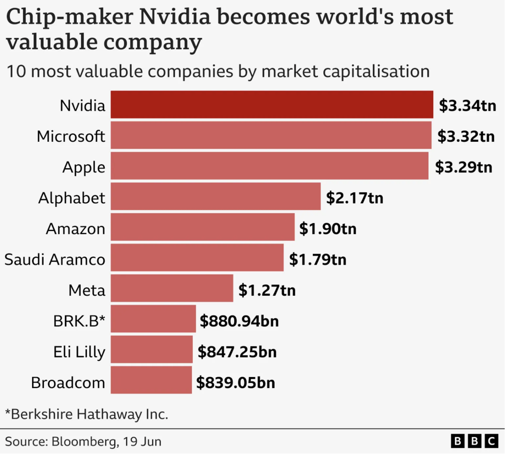

# Prologue

## The $100 Trillion Opportunity

**[Watch: The $100 Trillion AI Industrial Revolution by NVIDIA's Jensen Huang](https://www.youtube.com/watch?v=e5Zol4RYq2o)**

**[From AlexNet to AI Factories: Nvidia's Vision for a $100 Trillion Generative AI Economy](https://www.linkedin.com/pulse/from-alexnet-ai-factories-nvidias-vision-100-trillion-schwentker-bgt7c/)**

**Chip-maker Nvidia became the world's most valuable company after its share price climbed to an all-time high on June 19, 2024. It is now worth $3.34tn (£2.63tn), with the price having nearly doubled since the start of this year.**

[AI frenzy makes Nvidia the world's most valuable company](https://www.bbc.com/news/articles/cyrr40x0z2mo)

Nvidia is ushering in a new industrial revolution driven by generative AI - a fundamentally new way of computing. This revolution is centered around large language models and foundation models that can understand and generate content across different modalities like text, images, video, and more. It marks a shift from simply retrieving pre-recorded data to generating tailored content on-the-fly using AI.

Nvidia CEO Jensen Huang has signaled that his company aims to introduce a [new version of its flagship AI chips each year](https://asia.nikkei.com/Business/Technology/Jensen-Huang-hints-Nvidia-is-aiming-for-new-AI-chip-every-year) as the world's most valuable chipmaker aims to unlock $100 trillion worth of opportunities in a "new Industrial Revolution."

## Ask Question: FAQ GPT

[Panaversity FAQ GPT](https://chatgpt.com/g/g-8pZgUnd82-panaversity-faq-gpt)

## What are the Qualities of a Smart Individual

[How do you know someone is very smart? Here are 15 'subtle signs' people notice](https://www.upworthy.com/how-do-you-know-someone-is-very-smart-here-are-15-subtle-signs-people-notice)

## Applied Generative AI and Cloud-Native Developer Qualities and Skills

An Applied GenAI and cloud-native developer possesses a unique blend of skills and qualities that enable them to create, deploy, and manage intelligent applications within cloud environments. Here are the key qualities and skills such a developer should have:

### Technical Skills

1. **Programming Proficiency**
   - **Languages**: Expertise in programming languages commonly used in AI and cloud-native and web development, such as Python, and may be TypeScript.
   - **AI Frameworks**: Familiarity with AI frameworks and libraries such as PyTorch.
   - **API and Microservices Frameworks**: Expertise in 

2. **AI and Machine Learning Knowledge**
   - **Algorithms**: Understanding of machine learning algorithms, deep learning, neural networks, and natural language processing (NLP).
   - **Fine Tunning LLMs**: Fine-tuning AI models like ChatGPT, Gemini, and open source like Llama.

3. **Cloud Computing Expertise**
   - **Cloud Platforms**: Proficiency in using Open Source cloud platforms like Kubernetes, Kafka, and AI Powered Severless Platforms like Azure Container Apps (AKA).
   - **Cloud Services**: Knowledge of cloud services such as compute, storage, databases, machine learning, and AI services (e.g., OpenAI APIs, Google Gemini APIs).

4. **DevOps and Automation**
   - **CI/CD Pipelines**: Experience in setting up and managing Continuous Integration and Continuous Deployment (CI/CD) pipelines using tools like GitHub Actions.
   - **Infrastructure as Code (IaC)**: Proficiency with IaC tools such as Terraform.

5. **Containerization and Orchestration**
   - **Docker**: Expertise in containerizing applications using Docker.
   - **Kubernetes**: Skills in deploying, managing, and scaling containerized applications using Kubernetes.

6. **Data Management and Processing**
   - **Databases**: Knowledge of SQL databases, such as PostgreSQL, and Redis.
   - **Data Pipelines**: Experience with data processing frameworks like Apache Kafka.

7. **Security and Compliance**
   - **Security Best Practices**: Understanding of security best practices for AI and cloud applications, including identity and access management, encryption, and compliance standards like GDPR and HIPAA.

### Soft Skills

1. **Problem-Solving**
   - Ability to approach complex problems systematically and develop innovative solutions using AI and cloud technologies.

2. **Collaboration and Communication**
   - Strong communication skills to work effectively with cross-functional teams, including data scientists, software engineers, and business stakeholders.
   - Ability to explain technical concepts to non-technical stakeholders.

3. **Adaptability**
   - Willingness to continuously learn and adapt to new technologies, tools, and methodologies in the fast-evolving fields of AI and cloud computing.

4. **Attention to Detail**
   - Precision in developing and deploying applications, ensuring they are robust, secure, and perform well in various environments.

5. **Project Management**
   - Skills in managing projects, including planning, scheduling, and tracking progress to ensure timely delivery of AI and cloud solutions.

### Qualities

1. **Curiosity and Innovation**
   - A strong desire to explore new technologies and methodologies, fostering innovation in AI and cloud-native development.

2. **Resilience and Patience**
   - The ability to handle setbacks and failures, persistently working towards finding solutions and improving systems.

3. **Ethical Awareness**
   - A keen understanding of the ethical implications of AI and cloud technologies, ensuring responsible and fair use of these technologies.

### Continuous Learning

1. **Staying Updated**
   - Regularly following industry trends, attending conferences, and participating in professional communities to stay current with advancements in AI and cloud-native technologies.

2. **Certifications and Training**
   - Pursuing relevant certifications such as AWS Certified Solutions Architect, Microsoft Certified: Azure AI Engineer Associate, Google Professional Data Engineer, and other specialized AI and cloud certifications.

By embodying these skills, qualities, and a commitment to continuous learning, an AI and cloud-native developer can effectively contribute to the development of intelligent, scalable, and efficient applications that leverage the power of AI and cloud computing.